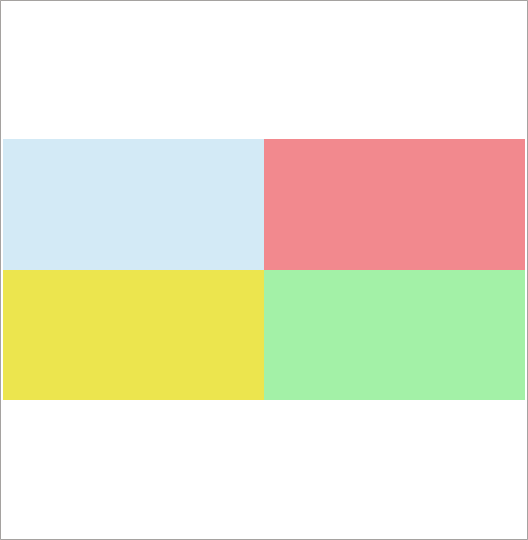
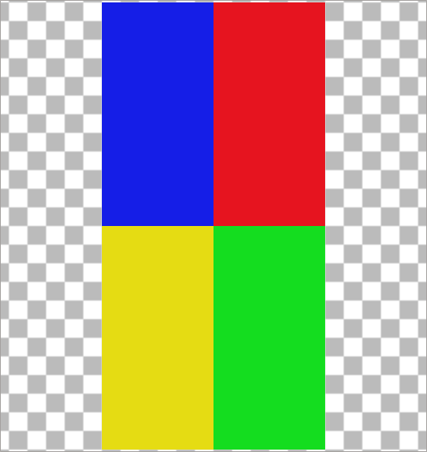
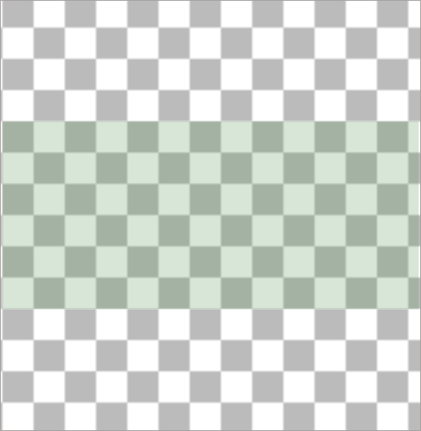

# Phase 1a side-by-side comparison — acceptance protocol

Status: the implementation and predeclared generated-fixture native gate have
passed their scoped reviews. Visible attempt 1 remains diagnostic because it
did not satisfy the distinct-aspect-ratio or cache-smaller-than-original
visual checks. Separately reviewed attempt 2 passed those checks and the other
declared native stages. Final public privacy/staging and fresh exact-head
hosted CI remain pending. The base design gate is cleared at
`docs/comparison-design.md` SHA256
`2a042e8620aa577f8b4626ebe7f4ac34b3450e4da4b3dafbc230777014647c15`. The
base acceptance below uses those cleared limits. Root and independent review
also approved the app-only gallery backpressure correction recorded in Task35,
which revises aggregate parent accounting to 256.5 MiB. Do not attribute this
amended accounting to the base design hash. The reviewed amendment and
one-child scratch/watchdog contract are recorded in `docs/comparison-design.md`
SHA256 `44c5ae1f6eaff34c1b3c862f50d9cc0826bbbe9ae12d0d7494d6d73bf8809e2b`;
the original `2a042e86…` hash remains historical attribution for the earlier
224 MiB base design. Implementation and each evidence class have separate
review results recorded below.
No comparison resource limit is inferred from SDD §19 candidate budgets.

This protocol implements the acceptance planning in
[`Task 36`](tasks/36-comparison-acceptance.md) and follows the source boundary
in [`Task 35`](tasks/35-comparison-implementation.md).

The cleared supported-image set for this comparison is PNG, JPEG, GIF, and
WebP using frame zero. Each captured target carries UUID, SHA-256, byte size,
media type, catalog revision, indexed absolute path, source ID, and a copied
admission row with source relation and last-observed health. A request token
binds dialog, pane, mode, and generation so late or mismatched results are
discarded. Cache content identity is separate from catalog metadata freshness.

## Previous increment closure: cached offline and external actions

PR19 merged at `0f7082a2e01afccfdf4b81ec2145dc8a6572287e`, preserving reviewed
tree `a540e804395f9744f911ddb73bf4298f9392275d`. Its exact reviewed head
`5220af45b93739c0f81e366402c11d26dd9b1ca6` passed 30/30 Core, Qt, and Tauri
jobs: Core push 37517747784, Core PR 37517754777, Qt PR 37517755173, and Tauri
PR 37517755028. Core Windows Python 3.11/3.13 push and PR jobs, plus the Qt
Windows Core prerequisite, each ran 263 tests with 260 passing and three named
capability skips. The Qt Windows suite passed 73 tests. Its skips were FIFO
creation (POSIX-only), POSIX resource controls unavailable on Windows, and a
host that denies renaming the generated source root while an open scan handle
exists; the separate injected-loss protocol was tested.

All five Qt frozen smoke gates passed on Linux, macOS, and Windows. The cached
preview smoke returned ready for a generated 48×40 image. The Linux child
reported `address_space_enforced=true` with `RLIMIT_AS=536870912` bytes; the
macOS child reported `false` after Darwin `setrlimit` returned `ValueError` for
the requested/effective 512 MiB ceiling, with cause unestablished; and Windows
reported `false` because address-space enforcement was unavailable on that
platform. These are address-space flags, not RSS or full-process-tree memory
measurements. Tauri Rust tests passed 4/4 per OS, with virtual-grid, schema-6,
100k-catalog, build, and artifact gates successful. Hosted passes do not claim
native Windows/macOS desktop qualification. The preceding Linux native
cached-offline attempt and its historical source/helper hashes remain separate
evidence; PR19 does not provide comparison evidence.

## Scope and immutable-target contract

Open a comparison only when the command is invoked with exactly two distinct,
supported image assets selected. Capture both immutable targets in deterministic
view order at invocation: stable asset identity, revision/content fingerprint,
indexed path/source identity, and the displayed dimensions or equivalent values
specified by the cleared design. Refuse any other count, duplicate identity,
unsupported selection, or inconsistent capture with an actionable message. Do
not silently choose a subset. Later selection, sort, filter, refresh, collection
membership, or catalog changes must not replace either captured target.

Each pane must identify its captured asset and current source/cache state. It
must show the dimensions of the pixels actually displayed, distinguish original
from indexed cached preview, disclose fallback/freshness and observed
availability, and surface an actionable error for unsupported, stale, corrupt,
or failed content. An unavailable pane must not prevent the other pane from
remaining usable. Cached pixels are never presented as original or full
resolution. Loading an original is an explicit per-pane action, allowed only
when current source eligibility and the captured fingerprint still match; the
identity is revalidated before presentation. Cache refusal never silently
regenerates or substitutes an original read.

Each pane has independent aspect-preserving fit, zoom, and pan, its own
transparency background choice, a meaningful pane-specific name, and a logical
Tab/focus order. Fullscreen and Escape behavior follow the cleared design.
Synchronized transforms, difference metrics, annotations/regions, editing, and
saved comparison workspace state are outside this increment.

Opening, displaying, transforming, or closing a comparison does not write
catalog rows, published cache namespace entries, or source media. For an
explicit-original action, before scratch exists the single child classifies the
canonical temporary base and protected namespaces within the same 12-second
operation deadline. Only after an approved base reply may the parent create
supervisor-owned scratch beneath that base; the same child rechecks the actual
scratch before original I/O or raw output. Scratch is outside source and
published cache roots and is removed only after confirmed reap. A denied or
unclassifiable base fails closed before scratch creation. Alias source/cache
temp bases, malformed/EOF/late/timeout/cancel handshakes also fail closed; there
is no fallback location or second child. The cache-only path remains the
unchanged service and must not resolve source paths. Fixture setup, injected
catalog/source drift, cache corruption, and fixture restoration are performed
outside the comparison action and separately bracketed by snapshots. A
comparison/cache read must never repair or regenerate the deliberately
corrupted derivative.

## Generated fixture and preservation preconditions

Use only fresh generated fixtures under an isolated temporary root. No user
artwork, network/NAS mounts, system associations, deployed catalog, external
editor, or source/output binary participates. Reproducible source fixture
contents must be defined before execution with the frozen source manifest:

| Fixture | Required property | Acceptance use |
| --- | --- | --- |
| Target A | Supported PNG with transparency, color/alpha marker pattern, and an aspect ratio distinct from Target B | Alpha/background behavior and pane A's independent transform |
| Target B | Supported JPEG with a nontrivial EXIF orientation and an asymmetric quadrant marker pattern | Correct oriented dimensions/appearance and pane B's independent transform |
| Target C | Separate generated recognized image whose source becomes unavailable only inside the fixture | Explicit unavailable-original state and per-pane failure isolation |
| Target D | Separate generated recognized image with deliberately corrupted cached derivative | Cache refusal/error isolation while the paired pane remains usable |
| Target E | Generated unsupported/opaque file only if the cleared format policy has an unambiguous unsupported path | Explicit unsupported-state and actionable error |

Create the generated catalog and required cache entries through supported
application APIs. Save SHA256+size for each generated source before interaction;
catalog path/revision/content identity, integrity and foreign-key results;
logical catalog/table digest and physical database/WAL snapshot as applicable;
cache key/file manifest; and collection membership/order. Keep raw paths and
UUIDs private. Record each snapshot's phase: no source-media bytes are added
or removed after the initial source manifest except the named generated
unavailability/corruption action; restore those mutations before the final
preservation comparison. Catalog and cache files are expected to change as
fixtures are created and exercised.

Before a visible run, record the helper SHA256 and all tested code/input hashes,
Python/Qt/Pillow versions, OS/display backend, visible geometry/scaling, and
whether thumbnails are enabled. The helper must verify a fresh unlocked desktop
and fail closed if session state or UI readiness is not established. Root alone
launches it after independent helper clearance.

## Predeclared stages and pass/refusal rules

The exact dialog/API field names, worker events, numeric limits, and error
codes are supplied by the cleared design and frozen helper. The stage semantics
below are fixed now; after clearance, encode each one explicitly in the helper
and receipt without broadening scope.

1. **Admission and target capture.** Show the generated gallery with at least
   three targets. Invoke comparison with exactly A and B; verify exactly two
   panes in deterministic view order and that each pane's identity/revision
   matches the selected row. Try zero, one, and three-item selections; each
   must refuse before admitting a pane load and leave the gallery usable.
   Since the Qt selection model cannot select one row twice,
   repeated-identity refusal is tested through the admission/API boundary with
   a forged duplicate target pair, not represented as a UI selection state.
2. **Cache-first view and truthful pixels.** Load A and B from verified cache
   entries. Verify labels say cached, report actual returned pixel dimensions,
   and preserve both aspect ratios. The orientation marker must appear at the
   orientation-correct location. The alpha marker must change only with that
   pane's background control. Do not claim ICC/profile fidelity.
3. **Independent transforms, focus, and keyboard delivery.** Fit, zoom, and pan
   A while asserting B's transform is unchanged; then repeat for B. Change
   A's background and assert B is unchanged. Verify names/labels, visible focus,
   and logical Tab order. Establish focus on each actual control and deliver
   declared keys through QtTest/native event APIs; record delivered keys and
   observed focus separately. This is not a human keyboard-only or assistive-
   technology qualification. Exercise fullscreen and Escape as specified by
   the cleared design.
4. **Explicit original loading.** While the generated source is eligible,
   explicitly request original loading for A and B independently. Only a
   paused/watching source with exactly one indexed matching entry is eligible;
   offline, denied, error, scanning, missing/nonindexed, or inconsistent source
   relations refuse. Standalone assets need no linked entry and remain
   availability-unchecked until bytes are validated. The loader checks fresh
   eligibility immediately before original I/O and again after decode, then
   verifies identity, fingerprint, actual oriented dimensions, and unchanged
   source hashes before delivery. Confirm one pane's action cannot replace the
   other pane's target or display state.
5. **Drift without retargeting.** While a comparison is open, change gallery
   selection; apply filter/sort; refresh; change a generated collection; and
   separately exercise revision-only metadata change and content/path/source
   drift for a captured target. For each, assert both pane identities remain
   the original captured pair. A revision-only metadata change with unchanged
   content/location remains a valid captured target and must be reported as
   metadata drift, not mislabeled as content change; the pane is never rebased.
   Explicit original reload after content/path/source drift must
   refuse or report the design-defined stale state before presentation; no
   hidden substitute target or source dispatch is allowed.
6. **Pane failure isolation.** In a separate generated fixture state, make one
   captured source unavailable and request its original. Assert the action is
   refused before the original reader is dispatched, reports observed
   availability/freshness, and leaves the other pane responsive. Separately,
   corrupt one cache entry and verify explicit local refusal/error while the
   paired pane remains usable. Test unsupported-format refusal at admission;
   do not model an unsupported file as a pane unless the cleared design
   explicitly supports that state after capture.
7. **Cancellation, timeout, and lifecycle.** Exercise pane-load start failure,
   cancellation, deadline/timeout, late result, dialog close/reopen, and a
   replacement request while cleanup is pending. Results that arrive after
   cancellation, timeout, close, or captured identity change must be discarded.
   Pending workers remain owned until the cleared cleanup condition is met; no
   replacement may exceed the one-dialog/two-admitted-pane-load policy. Also
   assert at most one outstanding scaled gallery delivery, finite stop-aware
   wait, acknowledgment for normal/stale/error deliveries, and release of the
   preceding full raw/QImage references before the next read. Verify the stop
   path while the producer is waiting. Record which assertions observe actual
   native worker behavior and which rely on spies, controlled signals, or
   programmatic state. Record actual stop/reap/cleanup outcomes, and verify
   reopen after cleanup succeeds. For explicit-original scratch creation, test
   aliased source/cache temporary bases refuse before scratch creation. Test
   typed-stage reply validation plus malformed, EOF, late, timeout, and cancel
   handshakes, including a child that writes only part of a framed reply and
   then stalls after the parent begins reading. An in-process watchdog must
   remain able to trigger terminate/kill on cancellation or deadline without
   waiting for the unfinished frame. Each path must close pipes and retain
   process ownership through confirmed reap, including when no scratch exists;
   assert that no thread remains blocked in the frame read after cleanup. No
   alternate scratch location or second child may be attempted. Record the
   concurrent path-move after validation as a residual race, not an atomic
   namespace guarantee. The watchdog and bounded terminate/kill grace do not
   guarantee a hard wall-clock bound when the kernel or transport cannot
   complete process termination or pipe closure.
8. **Preservation and final cleanup.** Restore the generated source fixture
   from saved fixture bytes outside the application,
   compare source SHA256+sizes with the manifest, and compare catalog logical
   state, integrity/FKs, cache files, collection members/order, and physical
   snapshots with the declared expected deltas. Restore the deliberately
   corrupted cache derivative from its saved generated bytes outside the
   application; cache-only reads must not repair it. Close all dialogs and
   windows, verify no owned comparison/gallery worker remains, then
   repeat the final source/catalog/cache comparison before removing the
   generated fixture.

## Bounds and concurrency evidence

The cleared comparison contract is one dialog, one active pane load, and one
queued pane request (at most two admitted loads total, one pending per pane).
Initial requests run Left then Right. The next load begins only after the prior
image is consumed or discarded on the GUI thread and its worker confirms
cleanup. Comparison and single-image inspectors are mutually exclusive. Existing
gallery thumbnail work may coexist under its current cap; scanner behavior is
unchanged. No load is silently superseded or queued without limit.

The unchanged cache path retains its existing limits: 16 KiB manifest, 20 MiB
encoded PNG, 512 entries, 2048 per dimension, 4,194,304 pixels/16 MiB RGBA, and
five seconds including startup and delivery. Explicit original comparison
loads are capped at 64 MiB encoded input, 8192 per dimension, 8,388,608 decoded
pixels/32 MiB RGBA, and twelve seconds beginning immediately before process
startup and ending at final delivery, including admission, input
verification/hash, decode, final checks, normalized output, and off-GUI
detached QImage copy. Original content is not downsampled.
The child sends exactly width×height×4 raw RGBA bytes (maximum 32 MiB) to a
canonical supervisor-owned scratch path; both child and supervisor validate
length and dimensions. QPixmap conversion/presentation is bounded to the GUI
thread.

Retained pane pixmaps are capped at 16,777,216 pixels/64 MiB. At replacement,
the documented comparison buffers total 160 MiB (old pixmaps 64 MiB, incoming
raw bytes 32 MiB, detached QImage 32 MiB, incoming pixmap 32 MiB). Add the
gallery's existing 64 MiB thumbnail LRU, up to 32 MiB for one full-gallery
transient raw/detached image, and 0.5 MiB for two scaled/outstanding delivery
buffers: the aggregate explicit parent pixel-buffer accounting is 256.5 MiB.
The app integration permits at most one outstanding scaled gallery delivery,
waits finitely and stop-aware, acknowledges each delivery in the receiver's
`finally` path including stale/error results, and releases prior full raw/QImage
references before reading the next result. Acceptance verifies the queue bound,
stale-delivery acknowledgement and stop while waiting. Original child
accounting documents up to 128 MiB encoded-input representations, 96 MiB
decoded representations and 32 MiB output, 256 MiB of explicit buffers. These
are not RSS or performance bounds; runtime, Qt, Pillow, allocator, graphics
driver, scheduling and disk effects are outside them.

The approved shared `preview.py` exception is lifecycle-only: retain strong
process/scratch ownership until confirmed reap; discard pixels and emit no
success after failed cleanup; signal success only after cleanup; keep GUI
cancel/close asynchronous; allow bounded off-GUI cleanup-only retry; retain
pending viewers and refuse replacement; and clear pixels on accepted close.
Preserve the existing original decoder, fingerprint, source-read, format,
orientation, color behavior, and decoder defaults. New comparison tests cover
this interaction. The only approved legacy-test adjustment is the three
bounded synchronization/cleanup/accepted-close assertions in
`test_gallery_usability.py::test_close_during_decode_and_thumbnail_queue_invalidation`;
no prior assertions were removed or weakened.

The child deadline starts before spawn. Cancellation is event-only on the GUI
thread. An in-process watchdog must be able to trigger process termination on
cancel/deadline even if a reader is blocked on an incomplete framed reply; the
reader must not own the only path that can notice timeout. After cancel/deadline,
terminate/join is bounded to one second, then kill/join to one second; this
cleanup grace is separate from the 5/12-second operation deadline. A dialog
retains its worker/process/pipes/scratch while cleanup is pending. Failed reap
blocks replacement/admission until a bounded off-GUI cleanup-only retry
confirms exit, closes pipes and removes scratch; it never reruns decode or
source I/O. Test a partial-frame stall directly and assert cleanup unblocks
the reader and leaves no owned worker/process. These watchdog and grace periods
do not promise a hard wall-clock bound if kernel or transport operations
themselves fail to complete; blocked kernel I/O is not claimed to be always
killable.

The 512 MiB child address-space policy remains platform-specific. Linux must
fail closed if an applicable cap cannot be applied. Darwin may report
`address_space_enforced=false` only when `setrlimit` returns `ValueError` for
the default/effective requested 536,870,912-byte limit; cause is unestablished.
Windows reports unavailable enforcement when that resource control is absent.
Other malformed limits, errors, or tightened caps refuse. Every smoke records
the actual result flag. This is address space, not RSS or process-tree memory;
NFR-010 remains Partial unless RSS is directly measured with its method and
scope.

## Local, frozen, and hosted validation

An initial affected focused lifecycle run is preserved in the private wrapper
work directory (beside, not inside, the repository) at
`work/comparison-lifecycle-checks/focused.log`, SHA256
`012a65f29b90335021e634a737f6029896949cba4b4f474a578c4c21918e3e68`. It ran
12 tests: 11 passed and the protected legacy
`test_close_during_decode_and_thumbnail_queue_invalidation` test failed its
immediate `worker.isRunning()` assertion after close. The approved lifecycle
change makes close asynchronous. Root and independent review approved adding
bounded synchronization to that assertion without removing or weakening it.
The corrected `prototypes/qt/tests/test_gallery_usability.py` has SHA256
`9a1289ef005de5c1ad5a733f9dfe30c0466651c36b7f2e012dd12a50b2d81238`; the
corrected focused 12-test slice passed in 1.929 seconds. Its private wrapper
log is
`work/comparison-lifecycle-checks/corrected.log`, SHA256
`4322eba55bae8047ad7b6bbec1a54dcb062809ff0c647775de00f0417f3ef28a`. Keep
the first failure unchanged and separate.

One full Qt suite passed after the compiled-runtime source slice was
independently cleared. Exact command:
`work/.venv-ratings-favorites-qt-build/bin/python -m unittest discover -s prototypes/qt/tests -q`
from `work/DefiantMaple-metadata`, with `QT_QPA_PLATFORM=offscreen`, isolated
XDG config/data/cache and temporary directories, and the original
`XDG_RUNTIME_DIR` preserved. Python 3.14.7, PySide6/Qt 6.11.2, and Pillow 12.3.0
were recorded. It ran 101 tests, exit 0, in 39.687 seconds wall time (39.275
seconds reported by unittest). The 2,500-byte private log is
`work/comparison-lifecycle-checks/full-qt-2026-10-07/full-qt.log`, SHA256
`9f84146d1aba0684164e661180eaf763bd46b26d6af219b22e5197cc17129f63`; its
receipt is SHA256
`cde0053774c69fe46c08f2f74c4715b549296e34a256823a77b854ac91d3c0fd`. The
40-file manifest of `defiantmaple/` and `prototypes/qt/` implementation/test
inputs matched before and after the run; the private manifests are separately
hashed in the receipt directory. This is offscreen suite evidence, not visible
native acceptance or frozen-package qualification.

Core was reused from merged-main run `37540658049`. Node/grid evidence was
reused from PR19 Tauri run `37517755028`, whose tree matches merged main; Root
verified relevant Core/Node inputs against the protected baseline. Neither
suite was rerun. The full offscreen suite and frozen-package checks passed;
native attempt 2 passed the scoped generated-fixture gate described below.
Fresh hosted CI and final staged-publication privacy validation remain pending.
Run the project's privacy validator on the final staged publication set and
directly validate new public JSON/images. Repeat a suite only if a check fails
or its inputs change.

Root's first isolated frozen build completed at the same source export. The
export contains 241 tracked/approved Git files; its complete manifest and all
13 independently cleared compiled-runtime inputs matched the export. The
export was captured at checkout HEAD `0f7082a2e01afccfdf4b81ec2145dc8a6572287e`
and tree `a540e804395f9744f911ddb73bf4298f9392275d`; this is a working-tree
snapshot, not a claim that the code was committed there. The isolated frozen
build from that source export used Python 3.14.7, PySide6/Qt 6.11.2, Pillow
12.3.0, Nuitka 4.2.2 and
pyside6-deploy, exited 0 after 339.357 seconds, and produced an unsigned
x86-64 ELF of 50,089,520 bytes, mode 755, SHA256
`43d94ab7fe594e77d1773a58f7a283dab7ca77a4ad614548fe140fa2af069dfe`.
It remains a private candidate; no deployed output was replaced.

All six frozen CLI smoke gates passed: thumbnail, gallery worker, desktop
identity, external no-permit probe, cached preview, and two-pane comparison.
The external probe reported READY with no permit, no dispatch, and cleanup
complete. Cached preview delivered 48×40 RGBA; the comparison smoke returned
oriented original pixels at 20×60, cache sizes 20×60 and 80×40, the expected
right-image alpha, an unavailable-original refusal, and cleanup complete. Both
Linux child smokes reported the 512 MiB `RLIMIT_AS` applied; this is an address-
space setting, not RSS or a process-tree bound. The benchmark catalog was a
generated schema-6 100,000-row fixture. The benchmark's review-state key events
changed that disposable catalog during measurement; its whole-package SHA is
not a preservation assertion. The separate comparison smoke checks that its
generated catalog's logical/physical SQLite state, source-media hashes/mtimes,
and published cache hashes remain unchanged across the action, while the
unavailable original stays missing. These are package-gate assertions, not
native-window observations.

The private package audit is
`work/comparison-lifecycle-checks/frozen-build-audit-attempt1-final.json`,
SHA256 `46a0720ba71a28b43b75422ef5a311d0f7651d7d0aa8e4b5889b46094a06e4bd`.
The frozen benchmark used placeholder cells only; it did not decode images or
read disk thumbnails and its offscreen timings are not compositor or
decoded-media responsiveness evidence. The frozen build must run the
comparison smoke together with all five existing Qt smokes, without relabeling
historical build receipts. The new comparison smoke uses generated content and
does not launch an editor/default application or read real user files.

## Generated-fixture native acceptance — attempt 2

Attempt 1 remains diagnostic: both panes displayed 72×144 pixels, so it did
not establish distinct aspect ratios or cached images smaller than their
originals. Root retained its raw receipt unchanged. Attempt 2 used a separately
reviewed helper at SHA256
`8ccd44bc0f824060a29809ca1acc4d91f39f15eed7a8809b73696d76e56db8d0` and exited
zero in 10.038 seconds. Independent review accepted this scoped visual gate;
the private raw receipt SHA256 is
`1c29ebdfc459215daa89cc7fc9c03343b616a76a7c8d5caa11176d5d152f93fa`.

The generated landscape-alpha image displayed at 600×300 and its cached copy
at 256×128; the EXIF-orientation-6 portrait displayed at 144×288 and cache at
128×256. Each cache is smaller than its original while preserving its aspect
ratio, and the A/B ratios are distinct. The helper checked quadrant/alpha
markers in the actual original and cached pane pixmaps. It also exercised cache
first, independent fit/zoom/pan/background controls, Tab focus, 60 guarded
QtTest key actions and two mouse drags. Focus was programmatically established;
this is not human keyboard-only or assistive-technology qualification.

The attempt refused zero-, one-, and three-item selection, duplicate targets,
and an unsupported copied admission row. It preserved captured targets under
selection/filter drift, reported metadata revision drift, and refused original
reload after content/path/source drift. A declared collection remove/re-add
changed that member's revision 2→4 and position 2→4 while preserving membership
and other asset fields. A generated missing-root scan recorded Offline; cache
still loaded with the captured original unavailable, and the disabled original
control emitted no click or new worker. Restoring the generated root alone did
not change recorded health; an explicit rescan restored Paused. Corrupt cache
was refused without repair while the other pane remained usable. Ten catalog
snapshots had valid SQLite integrity and no foreign-key violations; four
bracketed read-only phases matched logically and physically. The native receipt
reports source hashes/manifests preserved, worker/model cleanup complete, and
the temporary fixture removed. Root separately confirmed 224 protected files
and 15 deployed outputs unchanged at 18:00:36Z.

The public [attempt 2 receipt](evidence/comparison/attempt2/acceptance.json)
and [attempt history](evidence/comparison/attempt-history.json) are sanitized;
six linked pane images are byte-identical direct canvas-widget captures. The
raw native helper did not instrument attempted original-file I/O. A separate
focused child-spy test supports only its narrower no-attempted-I/O test claim.
The source launcher emitted a portal AppInfo registration warning, so installed
desktop identity is not qualified; no editor/default application was launched.
The 256.5 MiB value is explicit parent pixel-buffer accounting, not RSS or a
full-process-tree bound. This is one Nobara 44-derived KDE Wayland session, not
generic Fedora or native Windows/macOS qualification; no ICC/color-fidelity,
general performance, or deployed-output claim follows. Exact-head hosted CI
and final staged privacy validation remain pending.

The direct pane captures show cache-first, verified-original, and mixed
offline states. They contain only generated pixels and omit identity/path
labels.

Cache-first panes:

Verified-original panes:

Mixed offline panes:

For the published exact source head, audit the automatic Core push and PR
matrices (12 jobs each) and Qt PR matrix (3 jobs). The Tauri PR workflow filters
do not match this change set, so no automatic Tauri run is expected. A
`workflow_dispatch` was unavailable in the current review environment; no
Tauri dispatch was performed. Reuse prior Tauri run `37517755028` only as
baseline evidence after verifying the relevant source/workflow inputs are
unchanged against the protected baseline; do not call it a current-head pass.
Verify actual Windows Core totals and named skips in both
Core runs and in the Qt Windows Core prerequisite; verify Qt Windows suite
totals, all six frozen smoke fields and per-platform `address_space_enforced`;
inspect schema-6/package/benchmark/artifact steps and relevant Tauri
Rust/grid/schema/build/artifact evidence. Keep runs and artifacts tied to the
exact source SHA. A success conclusion with an unavailable or unapplied cap
does not demonstrate that cap; report it without upgrading unsupported
platform claims. Placeholder-grid benchmarks have no image decode or disk
thumbnail I/O and are not decoded-media responsiveness evidence.

## Evidence, privacy, and requirement map

Preserve each raw attempt immutably with helper/source/input hashes and stages.
Keep raw paths, UUIDs, command arguments, catalog rows, source/cache manifests,
and private logs outside public evidence. Publish only a sanitized aggregate
and visually reviewed app-only images containing fictional fixture data. Each
public pane image must be captured directly from the widget/canvas, not cropped
or edited from a full private screenshot; verify it is byte-identical to the
separately reviewed app-only capture and that the captured region contains no
path or UUID labels. Run the normal tracked-file privacy validator after
staging and validate public JSON directly when its path is outside scanner
coverage; manually scan path, UUID, executable-argument and per-image-vector
fields. Record raw/public JSON and image SHA256+size. Retain failures/setup
attempts; never overwrite an attempt or rerun just for a better screenshot. A
locked desktop is a native block, not permission to substitute offscreen
output.

| SDD IDs | Comparison evidence intended here | Boundary that remains outside this acceptance |
| --- | --- | --- |
| FR-UX-008 | Exactly two captured image panes; explicit original/cache states; actionable comparison errors | The combined requirement's external-open portion is already separately evidenced; broader editor/platform qualification remains open |
| FR-UX-002/003/006/007 | Pane transforms, focus and actual key delivery; stable captured targets; unavailable original behavior | General inspector/accessibility, configurable shortcuts, other commands, and wider offline scenarios |
| FR-MEDIA-001/003 | One oriented marker image, one alpha/background case, actual dimensions and aspect-preserving transforms | Cross-feature format consistency, high-DPI qualification, all backgrounds/formats, ICC/color fidelity and media expansion |
| NFR-003/007/009/010/015 | Worker/failure isolation, cancellation/reaping, focus, declared cap results and actionable partial/refusal states | General assistive technology, cross-platform native qualification, full-process-tree memory, RSS and unadopted §19 budgets |
| NFR-014 | Fictional fixtures and sanitized, directly validated public derivatives | No public private paths, raw catalog/argv, or per-image private labels/vectors |

No requirement status changes solely because comparison code or a test exists.
The comparison-specific generated-fixture gate mapped to FR-UX-008 passed in
independently reviewed attempt 2. FR-UX-008 remains Partial because it combines
comparison with the separately scoped editor/open actions and broader platform
qualification. Supporting SDD rows and unadopted performance budgets remain
Partial or deferred according to their existing tracker gates.
